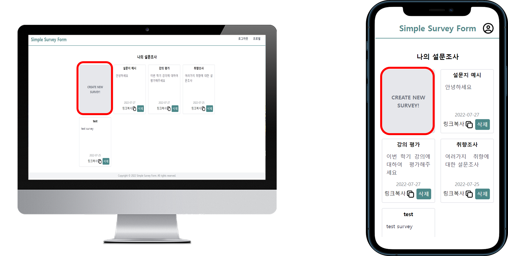
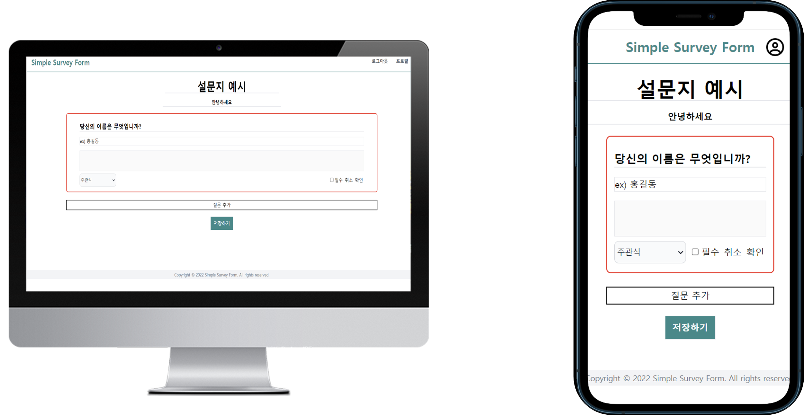

# 💡Simple Survey Form

- 설문조사 제작 사이트

</br>

# 1. 제작 기간 및 참여 인원

- 2022년 06월 22일 ~ 7월 28일
- 윤지원(팀장), 장동혁(팀원), 이서연(팀원)

</br>

# 2. 기술 스택

#### `Front-End`

- typescript
- react
- react-router-dom
- tailwind.css
- webpack

#### `Back-End`

- MongoDB
- mongoose
- axios
- express
- bcryptjs
- jsonwebtoken

</br>

# 3. ERD 설계


# 4. 핵심 기능

이 서비스에서 제가 맡은 핵심 기능은 설문조사 제작 및 배포와 카카오 로그인입니다.

## 4-1. 설문조사 제작

<details>
<summary><b>설문조사 제작 및 배포 설명 펼치기</b></summary>
<div markdown="1">

설문조사 과정은 제작 > 배포 > 응답 > 결과확인 순으로 이루어집니다.

### (1) 설문조사 제작



- 설문조사 제작은 로그인 후 이용할 수 있습니다.
- 홈화면의 Create Now 또는 프로필 > Create New Survey 버튼을 누르면 제작 페이지로 이동합니다.



- 설문지 제작 페이지에서는 설문지 제목, 설명, 질문 제목, 질문설명, 질문 타입, 필수 여부 등을 결정하여 설문지를 생성할 수 있습니다.
- 수정버튼을 누르면 질문을 수정할 수 있는 상태가 되며, 확인버튼을 누르면 질문이 저장됩니다.
- 질문의 유형은 짧은글, 객관식, 드롭다운, 다중선택, 파일, 점수, 날짜가 있습니다.
- 질문 유형 설명 : 블로그 주소 첨부

### (2) 설문조사 배포

### (3) 설문조사 응답

### (4) 설문조사 결과확인

</div>
</details>

<br/>

## 4-2. 카카오 로그인

<details>
<summary><b>카카오 로그인 설명 펼치기</b></summary>
<div markdown="1">

### (1) RESTful API란?

Representational State Transfer(REST)는 기본적으로 네트워크에서 통신을 관리하기 위한 지침으로 만들어진 소프트웨어 아키텍쳐입니다.  REST 아키텍처 스타일을 따르는 API를 REST API라고 하며, REST 아키텍처를 구현하는 웹 서비스를 RESTful 웹 서비스라고 합니다.

API 개발자는 서버 애플리케이션 API 문서에서 클라이언트가 REST API를 어떻게 사용해야 하는지 설명하고, 클라이언트는 리소스가 필요할 때 API를 사용하여 서버에 접속합니다.
대략적인 순서는 다음과 같습니다.

1.  클라이언트가 서버에 요청한다. API 문서에 따라 서버가 이해할 수 있는 방식으로 요청 형식을 지정한다.
2.  서버가 클라이언트를 인증(auth)하고 해당 요청을 수행할 수 있는 권한이 클라이언트에 있는지 확인한다.
3.  서버가 요청을 수신하고 내부적으로 처리한다.
4.  서버가 클라이언트에 응답을 반환한다. 응답에는 요청 성공 여부와 클라이언트가 요청한 모든 정보가 포함된다.

</br>

**요청에 포함되는 주요 요소**

- URL(Uniform Resource Locator)
- HTTP 메소드 : GET, POST, PUT, DELETE
- HTTP 헤더 : 클라이언트와 서버간에 교환되는 메타데이터, 파라미터

**응답에 포함되는 주요 요소**

- 상태코드 : 200, 201, 400, 404
- XML 또는 JSON 방식의 본문
- 헤더 : 서버, 인코딩, 날짜 등

### (2) 카카오 로그인 과정

사전 작업은 다음과 같습니다.  
자세한 내용은 **[카카오 로그인 > 설정하기](https://developers.kakao.com/docs/latest/ko/kakaologin/prerequisite)** 참고

- **플랫폼 등록** : 내 애플리케이션에 등록
- **카카오 로그인 활성화** : 내 애플리케이션 > 제품 설정 > 카카오 로그인 활성화
- **Redirect URI 등록** : 내 애플리케이션 > 카카오 로그인 > Redirect URI 등록
- **필요한 동의항목 설정** : 내 애플리케이션 > 카카오 로그인 > 동의항목 > 개인정보

### 첫 번째 로그인

**1\. 카카오 계정 로그인**


```ts
//카카오 로그인 버튼 클릭 시
window.location.href = `https://kauth.kakao.com/oauth/authorize?client_id=${data.REST_API_KEY}&redirect_uri=${data.REDIRECT_URI}&response_type=code`;
```

- 위 코드를 실행 시 제일 먼저 카카오 측에서는 kakao.com **쿠키 존재 여부를 확인**합니다.
- 첫 로그인일 경우 쿠키가 존재하지 않으므로 account.kakao.com/login에 접속해 **로그인** 합니다.
- 로그인을 하면 kakao.com에 종속적으로 **쿠키를 생성**합니다.

**2\. 동의화면 및 인가코드 받기**


- 로그인을 하면 아까 요청했던 주소로 돌아가 **동의화면이 출력**됩니다.
- 동의하고 계속하기 클릭 시, **redirect_uri**로 요청에 대한 응답이 전달됩니다.
- 응답은 **쿼리 파라미터**로 **인가코드(code)**, state, error, error_description이 있습니다.
- redirect_uri에 해당하는 컴포넌트에서 다음과 같이 **인가코드를 받아 저장**해줍니다.

```ts
const [code, setCode] = useState("");

useEffect(() => {
  setCode(new URL(window.location.href).searchParams.get("code") as string); //인가코드
}, []);
```

**3\. 토큰 받기**

```ts
const params = new URLSearchParams({
  grant_type: "authorization_code",
  client_id: socialKeys.REST_API_KEY,
  redirect_uri: socialKeys.REDIRECT_URI,
  code: code,
  client_secret: socialKeys.CLIENT_SECRET_KEY,
});

const kakaoResponse = await axios.post(
  "https://kauth.kakao.com/oauth/token",
  params
);
```

- 인가코드 등을 위와 같이 POST로 요청합니다.
- 응답으로 token_type, access_token, **id_token**, expires_in, refresh_token, refresh_token_expires_in  등이 옵니다.
- **id_token을** **디코딩**하여 **email, sub(고유 회원번호)를 추출해 DB에 저장**합니다.
- **토큰을 쿠키에 저장**하고 사용자를 반환하면 로그인이 완료됩니다.

### 두 번째 로그인

이미 한 번 카카오 로그인을 진행했고 동의항목에 동의 한 경우에는, 카카오에서 쿠키를 확인하고 바로 인가코드를 보내줍니다. 이후 과정은 위와 동일합니다.

</div>
</details>

<br/>

# 5. 트러블 슈팅 및 회고

<br/>

# 기타

## 1. 실행 관련

- server : npm run dev
- client : /cd frontend / npm run dev

## 2. env에 필요한 것들

#### `Client`

#### `Server`

- REST_API_KEY
- REDIRECT_URI
