# 개관



## 클라이언트

### `/surveys` 라우트

`SurveysLayout`으로 둘러 싸여 있습니다.

**SurveysLayout**

```js
useEffect(() => {
  await getSurveys()
}, [])
```

`surveysList` 상태를 초기화 하는 과정입니다. 이곳에서 `Outlet context`를 통해서 `surveys`를 내보냅니다.

### `/surveys/:surveyId` 라우트

`SurveyLayout`으로 둘러 싸여 있습니다.

**SurveyLayout**

`SurveysLayout context`로부터 `surveys`를 받아 `surveyId`에 해당하는 `survey` 상태를 뽑아내서 `Outlet context`로 `survey`를 내보냅니다.

## 데이터베이스 초기화

### admin user와 role 생성

```bash
npx ts-node src\migrations\create-tables.ts
```

### role 테이블 초기화

기존의 roles 테이블 항목들을 모두 삭제하고 새로 생성합니다.

```bash
npx ts-node src\migrations\create-roles.ts
```
